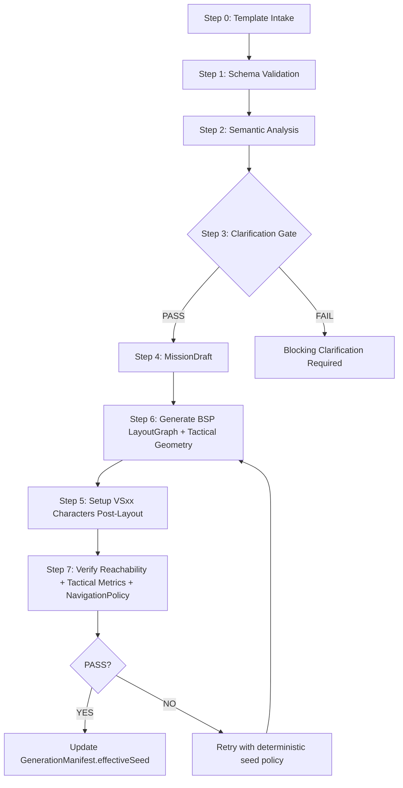

# Tactical Breach Mission Architecture v2.2

Document: Technical architecture specification  
System: `Breach Scenario Engine (BSE)`  
Technologies: `Unity 6`, `Burst Compiler`, `Unity Awaitable`, `Addressables`  
Version: 2.2

This document is the single source of truth for mission generation order,
seed ownership, tactical theme validation, profile versioning, navigation
verification, generation locks, and acceptance gates.

## 1. Document Authority

This document is the authoritative architecture contract for the current
project version.

Any document that describes mission generation must not contradict:

- this architecture specification
- [mission_template_v2.2.md](mission_template_v2.2.md)
- [mission_data_contract_v2.2.md](mission_data_contract_v2.2.md)

Legacy notes remain valid only when they do not conflict with this document.

## 2. Version Matrix

| Artifact | Canonical Version | Status | Required Action |
|---|---:|---|---|
| MissionArchitecture_Canonical | v2.2 | Active | Primary reference |
| Mission Template | v2.2 | Active | Use canonical order and template split rule |
| Mission Data Contract | v2.2 | Active | Final payload contract for Unity DTO parsing |
| MCP Resource Pipeline | v2.2 | Active | Must use Step 6 -> Step 5 -> Step 7 |
| Legacy v1.4 docs | v1.4 | Deprecated | Migrate to current v2.2 contract |

## 3. Canonical Execution Order

The main invariant is `layout before characters`.

Characters, enemies, hostages, patrol anchors, cover reservations, and
incident triggers cannot be placed before BSP/Layout and TacticalGraph
generation is complete.



### Blocking Invariants

1. Step 6 must produce `LayoutGraph`, `RoomGraph`, `PortalGraph`,
   `CoverGraph`, `VisibilityGraph`, and `HearingGraph` before Step 5 begins.
2. Step 5 must fail with `ORDER_VIOLATION_NO_LAYOUT_GRAPH` if
   `LayoutGraph.status != Generated`.
3. Step 7 must fail with `ORDER_VIOLATION_PLACEMENT_BEFORE_LAYOUT` if any
   generated character has no valid `roomId`, `navNodeId`, or
   `layoutRevisionId`.
4. Retry loops must return to Step 6, not Step 5, because placement depends on
   regenerated topology.

## 4. Seed Integrity and Deterministic Replay

`GenerationManifest` is the only authoritative owner of `effectiveSeed`.

The user template may define an initial seed, but it must not claim final
replay authority until the pipeline passes verification.

### Field Semantics

| Field | Owner | Before PASS | After PASS | Mutable? |
|---|---|---:|---:|---|
| `template.seed` | User Template | required | preserved | no, unless user edits template |
| `generationMeta.requestedSeed` | Payload Compiler | copied from template | preserved | no |
| `generationMeta.effectiveSeed` | GenerationManifest | `0` or `null` | final replay seed | no after PASS |
| `generationMeta.retrySeeds[]` | GenerationManifest | empty | attempted seeds in order | append-only |
| `generationMeta.layoutRevisionId` | Step 6 | absent | hash/revision of accepted LayoutGraph | immutable after PASS |

### Rules

1. Before Step 7 PASS, `effectiveSeed` must be `0` or `null`.
2. After Step 7 PASS, `effectiveSeed` is written exactly once by
   `GenerationManifest`.
3. If retry is required, retries must derive from `requestedSeed` using a
   deterministic policy:
   `retrySeed = Hash32(requestedSeed, missionId, retryIndex, pipelineVersion)`.
4. Replay must use `effectiveSeed`, not `template.seed`, when
   `GenerationManifest.status == PASS`.
5. Any divergence between `effectiveSeed`, `layoutRevisionId`, and scene
   generated markers is blocking.

### Blocking Error Codes

- `SEED_EFFECTIVE_WRITTEN_BEFORE_PASS`
- `SEED_OWNER_CONFLICT`
- `SEED_REPLAY_MISMATCH`
- `SEED_RETRY_POLICY_UNDECLARED`

## 5. TacticalThemeProfile and Tactical Density

Theme thresholds are defined only in `TacticalThemeProfile.asset`.

The mission template may reference `tacticalTheme`, but it must not redefine
contradictory noise thresholds.

### TacticalThemeProfile Fields

```yaml
profileType: TacticalThemeProfile
assetVersion: 2
profileId: TacticalThemeProfile_Default_v2
profiles:
  stealth:
    noiseAlertThresholdNormalizedMax: 0.15
    enemyHearEntryPercentMax: 15
    maxDoorBreachNoiseRadiusMeters: 4.0
    maxGunshotPropagationRooms: 1
    requireSuppressedEntry: true
  dynamic:
    noiseAlertThresholdNormalizedMin: 0.15
    noiseAlertThresholdNormalizedMax: 0.35
    enemyHearEntryPercentMax: 35
    maxDoorBreachNoiseRadiusMeters: 7.5
    maxGunshotPropagationRooms: 2
    requireSuppressedEntry: false
  loud:
    noiseAlertThresholdNormalizedMin: 0.35
    noiseAlertThresholdNormalizedMax: 1.0
    enemyHearEntryPercentMax: 100
    maxDoorBreachNoiseRadiusMeters: 12.0
    maxGunshotPropagationRooms: 4
    requireSuppressedEntry: false
```

### Validation Rules

1. If the template sets `tacticalTheme: stealth`, then
   `noiseAlertThreshold <= TacticalThemeProfile.stealth.noiseAlertThresholdNormalizedMax`.
2. `enemyHearEntryPercent` is derived in Step 7 from HearingGraph, not
   hand-authored.
3. Template-level `noiseAlertThreshold` is treated as mission intent.
   Profile-level thresholds are authoritative validation limits.
4. A contradiction between mission intent and profile limits is
   `THEME_NOISE_THRESHOLD_CONFLICT`.

### Budget-Aware Tactical Density

Tactical density controls room pressure without exceeding platform budgets.

```yaml
tacticalDensity:
  minEnemiesPerOccupiedRoom: 1
  targetEnemiesPerOccupiedRoom: 2
  maxEnemiesPerRoom: 3
  maxEmptyRooms: 1
  maxTotalEnemies: 12
  minCoverPiecesPerRoom: 3
  minAlternateRoutes: 2
  minHearingOverlapPercentage: 35
```

Validation:

1. `minTotalEnemies = minOccupiedRooms * minEnemiesPerOccupiedRoom`
2. `targetTotalEnemies = min(maxTotalEnemies, minOccupiedRooms * targetEnemiesPerOccupiedRoom)`
3. `hardCap = min(maxTotalEnemies, maxRooms * maxEnemiesPerRoom)`
4. If `minTotalEnemies > maxTotalEnemies`, fail with
   `TACTICAL_DENSITY_IMPOSSIBLE_BUDGET`.
5. If any room has `enemyCount > maxEnemiesPerRoom`, fail with
   `TACTICAL_DENSITY_ROOM_OVERFLOW`.
6. If empty rooms exceed `maxEmptyRooms`, fail with
   `TACTICAL_DENSITY_EMPTY_ROOM_OVERFLOW`.
7. If the platform budget is exceeded without override, fail with
   `TACTICAL_DENSITY_PLATFORM_BUDGET_CONFLICT`.

## 6. Phase and Render Compatibility

```yaml
renderProfile:
  profileId: RenderProfile_Android2D_Phase1_v2
  targetPlatform: Android_2D
  phaseConstraint: 1
  useNormalMaps: false
  use2DLights: true
  useSpriteAtlasV2: true
  compressionPolicy: Android_ASTC_6x6
  performanceBudget:
    targetFPS_Android: 60
    maxLight2D: 12
    maxDynamicLight2D: 4
    maxActiveHearingChecks: 20
    maxVisibilityRaysPerVerification: 2000
    maxGeneratedGameObjects: 450
    requireSRPBatcherCompatibleMaterials: true
    requireFrameDebuggerPass: true
```

### Phase Compatibility Rules

1. `useNormalMaps: true` requires `phaseConstraint >= 1.5` and valid secondary
   textures in Sprite Atlas v2.
2. `phaseConstraint: 1` must use fallback-safe visuals. Sprite-Lit material is
   allowed, but missing normal maps must not break compile.
3. Step 7 must include render budget checks:
   - Light2D count
   - active hearing checks
   - visibility rays
   - generated GameObject count
   - SRP Batcher compatibility
4. Failure code for invalid normal maps:
   `RENDER_PHASE_NORMALMAPS_UNSUPPORTED`.

## 7. NavigationPolicy Verification

`NavigationPolicy` defines movement validation for operators, enemies,
hostages, and civilians.

### Required Fields

```yaml
navigationPolicy:
  policyId: NavigationPolicy_Phase1_GridAStar_v2
  strictNavigationPolicy: true
  primarySolver: CustomGridAStar2D
  fallbackSolver: None
  navMesh2DAllowed: false
  requireBreachPointReachability: true
  requireObjectiveReachability: true
  requireExtractionReachability: true
  maxUnreachableTacticalNodes: 0
```

### Step 7 Checks

1. Every operator spawn can reach every required breach point.
2. Every breach point has at least one valid path to objective room.
3. Hostage and civilian objective rooms have valid extraction path.
4. Enemy placements are reachable by their assigned patrol graph unless
   intentionally stationary.
5. Cover nodes used by AI must be reachable and not inside blocked colliders.
6. If `strictNavigationPolicy: true`, any unreachable critical node is
   blocking.

Blocking error codes:

- `NAV_BREACHPOINT_UNREACHABLE`
- `NAV_OBJECTIVE_UNREACHABLE`
- `NAV_EXTRACTION_UNREACHABLE`
- `NAV_COVER_NODE_BLOCKED`
- `NAV_SOLVER_UNDECLARED`

## 8. Profile Assets and Validation

All reusable generation limits must live in ScriptableObject profiles under:

`Assets/Data/Mission/Profiles/`

Required profiles:

- `TacticalThemeProfile.asset`
- `PerformanceProfile.asset`
- `RenderProfile.asset`
- `NavigationPolicy.asset`
- `TacticalDensityProfile.asset`
- `AddressablesCatalogProfile.asset`

### Required Interface

```csharp
public interface IValidatableProfile
{
    string ProfileId { get; }
    int AssetVersion { get; }
    ValidationResult Validate(ProfileValidationContext context);
}
```

Every profile must include:

- `profileId`
- `assetVersion`
- `schemaVersion`
- `ownerSystem`
- `lastMigrationVersion`

Step 1 must fail if a required profile is missing, has unsupported
`assetVersion`, or produces validation errors.

## 9. GenerationLocks

The generator must prevent concurrent writes to the same mission scene,
MissionConfig, or GenerationManifest.

### Lock Scope

```yaml
generationLocks:
  lockMissionId: true
  lockMissionConfigAsset: true
  lockGeneratedSceneRoot: true
  lockGenerationManifest: true
  lockAddressablesCatalogRead: false
  lockTimeoutSeconds: 30
```

### Rules

1. Step 6 must acquire locks before mutating LayoutGraph or generated scene
   roots.
2. Step 5 must verify that the same lock owner produced the current
   `layoutRevisionId`.
3. Step 7 must include lock owner and manifest revision in verification output.
4. Concurrent compile attempts for the same `missionId` must fail with
   `GENERATION_LOCK_CONFLICT`.

## 10. Mission ID Naming Convention

Canonical mission ID format:

`VS##_ShortMissionName`

Examples:

- `VS01_HostageApartment`
- `VS02_OfficeRaid`
- `VS03_WarehouseBreach`

Legacy `TBM_####_*` IDs are deprecated and may only appear in migration notes.

### Migration Rule

- `TBM_0001_HostageApartment` -> `VS01_HostageApartment`
- `VS01_generation_payload.json` must reference
  `missionId: VS01_HostageApartment`
- Generated scene root: `Generated/VS01_HostageApartment`
- Manifest: `GenerationManifest_VS01_HostageApartment.json`

## 11. Acceptance Criteria

A generated mission can be accepted only if all gates below pass.

### Order and Replay

- `Step 6 -> Step 5 -> Step 7` execution order confirmed.
- `LayoutGraph.status == Generated` before character placement.
- `GenerationManifest.effectiveSeed` written only after PASS.
- Replay from `effectiveSeed` reproduces identical `layoutRevisionId`.

### Tactical Validity

- TacticalThemeProfile thresholds match mission intent.
- TacticalDensity budget is satisfiable.
- No critical room violates enemy density cap.
- Hearing overlap is within profile thresholds.
- Cover density meets minimum per occupied room.

### Navigation

- NavigationPolicy is declared.
- All breach, objective, and extraction paths are reachable.
- No required tactical node is unreachable when
  `strictNavigationPolicy: true`.

### Render and Performance

- Phase/render compatibility is valid.
- Light2D count is within RenderProfile budget.
- Active hearing and visibility checks are within PerformanceProfile budget.
- SRP Batcher compatibility is verified.
- Frame Debugger pass is completed for Phase >= 1.5.

### Data and Asset Integrity

- All profile assets implement versioning.
- Addressables keys resolve.
- No missing scripts or broken prefab links.
- All generated objects have `McpGeneratedMarker` and stable key.

### Required Machine-Readable Output

Step 7 must return JSON with:

```json
{
  "status": "PASS_OR_FAIL",
  "missionId": "VS01_HostageApartment",
  "pipelineVersion": "2.2",
  "effectiveSeed": 0,
  "layoutRevisionId": "",
  "findings": [],
  "metrics": {
    "enemyCount": 0,
    "roomCount": 0,
    "emptyRoomCount": 0,
    "light2DCount": 0,
    "activeHearingChecks": 0,
    "visibilityRayCount": 0,
    "unreachableCriticalNodes": 0
  }
}
```

Blocking if output is Markdown-only or requires free-text parsing.

## 12. Template Organization Rule

User-facing authoring remains a single annotated mission template.

Internally, Codex may compile it into modular sections:

- `core_identity`
- `spatial_constraints`
- `tactical_flow`
- `noise_model`
- `navigation_policy`
- `visual_style`
- `performance_budget`
- `acceptance_criteria`

Do not require the designer to edit multiple small files for a normal mission.
Split files are compiler artifacts or advanced overrides only.

## 13. Glossary

- `LayoutGraph`: topological graph of rooms, portals, corridors and
  boundaries generated by BSP.
- `RoomGraph`: subset of LayoutGraph describing room nodes and adjacency.
- `PortalGraph`: doors, windows, breach points and transition edges between
  rooms.
- `TacticalGraph`: aggregate graph used for tactical evaluation; includes
  layout, visibility, hearing and cover data.
- `VisibilityGraph`: precomputed line-of-sight relationships between tactical
  nodes.
- `HearingGraph`: precomputed acoustic propagation graph with occlusion
  weights.
- `CoverGraph`: candidate cover nodes with scoring metadata.
- `NavigationPolicy`: rule set defining valid pathfinding solver, reachability
  requirements and blocking thresholds.
- `GenerationManifest`: final authoritative record for deterministic replay,
  effectiveSeed, layoutRevisionId and verification result.
- `McpGeneratedMarker`: component or metadata marker proving generated-object
  ownership and stable key identity.

