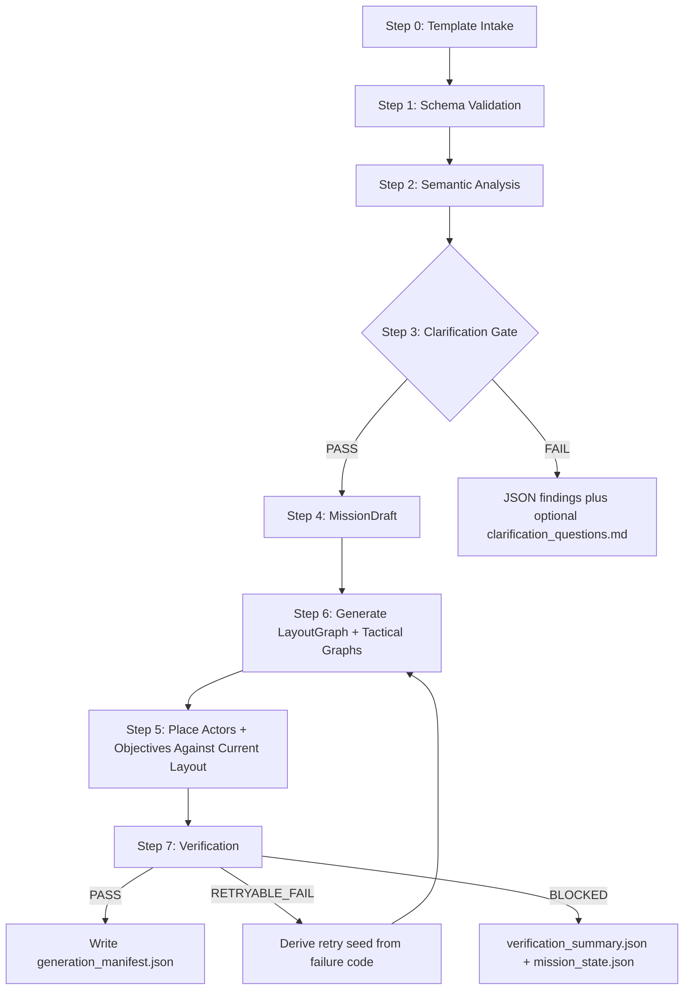

# Tactical Breach Mission Architecture v2.3

Document: Stabilization architecture contract
System: `Breach Scenario Engine (BSE)`
Unity target: `6000.4.3f1`
Version: 2.3
Status: Active documentation contract

Target platforms:

- Primary: Windows 10 / 11 desktop, 1920x1080+ resolution, 16:9 or wider
- Secondary: Android mobile, 1080p portrait and landscape, touch controls, and
  optional controller support
- UI: scalable across supported desktop and mobile resolutions

This document is the repo-owned source of truth for the v2.3 mission
generation architecture. It supersedes the active v2.2 reading path while the
v2.2 files remain available as historical references.

## 1. Document Authority

Mission generation work must not contradict this document or the v2.3 contract
set:

- [mission_pipeline_contract_v2.3.md](mission_pipeline_contract_v2.3.md)
- [mission_authoring_contract_v2.3.md](mission_authoring_contract_v2.3.md)
- [mission_template_v2.3.md](mission_template_v2.3.md)
- [mission_data_contract_v2.3.md](mission_data_contract_v2.3.md)
- [generation_manifest_contract_v2.3.md](generation_manifest_contract_v2.3.md)

[audit_current_state_v2.3.md](audit_current_state_v2.3.md) records the factual
baseline before this contract set was created. When implementation differs from
v2.3, treat the audit as gap evidence and this document as the target.

## 2. Version Matrix

| Artifact | Canonical Version | Status | Required Action |
|---|---:|---|---|
| Mission Architecture | v2.3 | Active | Primary reference |
| Mission Template | v2.3 | Active | Single authoring template path |
| Mission Authoring Contract | v2.3 | Active | User/compiler/pipeline ownership |
| Mission Pipeline Contract | v2.3 | Active | Step 0-7 and MCP envelope |
| Mission Data Contract | v2.3 | Active | Generated payload shape |
| Generation Manifest Contract | v2.3 | Active | Accepted replay record |
| v2.2 contract set | v2.2 | Superseded | Historical implementation baseline |

## 3. Non-Negotiable Invariants

1. Step 6 always runs before Step 5.
2. Placement must fail when it does not have the current `layoutRevisionId`.
3. Retry returns to Step 6, then reruns Step 5 and Step 7.
4. `generation_manifest.json` is written only after
   `verification_summary.status == "PASS"`.
5. `effectiveSeed` is written only after PASS.
6. MCP mission decisions are JSON-only. Markdown logs may exist only as
   human-readable duplicates.
7. Schema, authoring, profile, and lifecycle failures are not retryable layout
   failures.

## 4. Canonical Execution Order

The main ordering rule is still layout before placement.

Step numbers intentionally preserve the historical design language: Step 6 is
layout generation and Step 5 is post-layout placement.

## 5. Artifact Ownership

All generated mission artifacts are mission-scoped under:

`UserMissionSources/missions/<missionId>/`

| Artifact | Owner | Git posture | Notes |
|---|---|---|---|
| `mission_design.template.yaml` | designer | tracked | Single normal authoring file |
| `mission_payload.generated.json` | compiler | ignored | Must satisfy v2.3 payload contract |
| `mission_compile_report.json` | compiler | ignored | JSON report, not a decision source by prose |
| `mission_layout.generated.json` | Step 6 | ignored | Owns current `layoutRevisionId` |
| `mission_entities.generated.json` | Step 5 | ignored | Must reference current layout |
| `verification_summary.json` | Step 7 | ignored | Machine-readable PASS/FAIL and retry class |
| `generation_manifest.json` | accepted pipeline | ignored | Written only after PASS |
| `mission_state.json` | pipeline lifecycle | ignored | Current state, step, job, and diagnostics |
| `.generation.lock` | pipeline lifecycle | ignored | Mission-scoped concurrent write guard |

The pipeline must never require an agent to parse Markdown to decide whether to
continue, retry, or stop.

## 6. Profile and Catalog Root Decision

v2.3 keeps the existing project data root as authoritative:

- global profiles: `Assets/Data/Mission/Profiles/`
- global catalogs: `Assets/Data/Mission/Catalogs/`
- per-mission profile overrides:
  `Assets/Data/Mission/MissionConfig/<missionId>/Profiles/`
- per-mission catalog overrides:
  `Assets/Data/Mission/MissionConfig/<missionId>/Catalogs/`

`Assets/TacticalBreach/Profiles/` and `Assets/TacticalBreach/Catalogs/` are not
active v2.3 roots. They require an explicit migration plan before use.

Required profile files for the v2.3 contract:

- `TacticalThemeProfile.asset`
- `PerformanceProfile.asset`
- `RenderProfile.asset`
- `NavigationPolicy.asset`
- `TacticalDensityProfile.asset`
- `AddressablesCatalogProfile.asset`

Typed catalog assets are part of the v2.3 target content layer and must live
under the catalog root when implemented:

- `EnemyCatalog.asset`
- `EnvironmentCatalog.asset`
- `ObjectiveCatalog.asset`

## 7. Lifecycle State

`mission_state.json` records generation progress and is the authoritative place
for incomplete or failed runs.

Allowed lifecycle states:

- `IDLE`
- `VALIDATING`
- `COMPILED`
- `LAYOUT_GENERATED`
- `ENTITIES_PLACED`
- `VERIFYING`
- `RETRYING`
- `PASS`
- `FAILED`
- `BLOCKED`

`write_manifest` may run only when the current state and verification summary
prove that Step 7 passed for the current layout.

## 8. Generation Locks

The mission-scoped lock path is:

`UserMissionSources/missions/<missionId>/.generation.lock`

The lock protects generated artifacts, MissionConfig mutations, and manifest
creation for the same mission id. Concurrent generation attempts for the same
mission must fail with `GENERATION_LOCK_CONFLICT`.

The lock record must include enough data for diagnostics:

- `missionId`
- `jobId`
- `lockOwner`
- `startedAtUtc`
- `updatedAtUtc`
- `currentStep`
- `processId` when available

Stale locks require an explicit diagnostic cleanup path. A stale lock must not
silently permit two writers.

## 9. Retry and Seed Integrity

`effectiveSeed` is accepted replay data. It remains `0` or absent until Step 7
returns PASS.

Retry seeds use the v2.3 policy:

`retrySeed = Hash32(requestedSeed, missionId, layoutAttemptIndex, failureCode, pipelineVersion)`

The failure code is part of the hash so a retry chain is tied to the verified
failure that caused it. Retry always starts at Step 6, because a new seed may
change room topology and invalidate prior placement.

Retryable codes:

- `NAV_BREACHPOINT_UNREACHABLE`
- `NAV_OBJECTIVE_UNREACHABLE`
- `LAYOUT_GENERATION_FAILED`
- `TB-AUD-003`
- `TACTICAL_DENSITY_IMPOSSIBLE_BUDGET`

Template, schema, profile, unsupported version, and lock errors are blocking.

## 10. Package and Content Boundaries

The v2.3 docs describe the target architecture, not a claim that every package
or typed asset already exists. Package alignment and typed catalog work are
owned by later v2.3 sessions.

Until package alignment lands, docs must not require code to use Addressables,
Burst, Collections, Jobs, or AI Assistant unless the package is present and the
runtime path has been verified. Logical profile and catalog references may be
validated through AssetDatabase or Addressables according to the active runtime.

## 11. Acceptance Criteria

A generated mission is accepted only when:

- Step 6 completed before Step 5.
- Step 5 used the current `layoutRevisionId`.
- Step 7 returned JSON `status: "PASS"`.
- `generation_manifest.json` has `status: "PASS"`.
- `effectiveSeed` is non-zero and written after PASS.
- `retrySeeds` records every attempted retry seed.
- All machine decisions are available in JSON artifacts or MCP envelopes.
- Generated scene objects have stable generated ownership markers.
- Payload, manifest, and verification artifacts use repository-relative paths.
