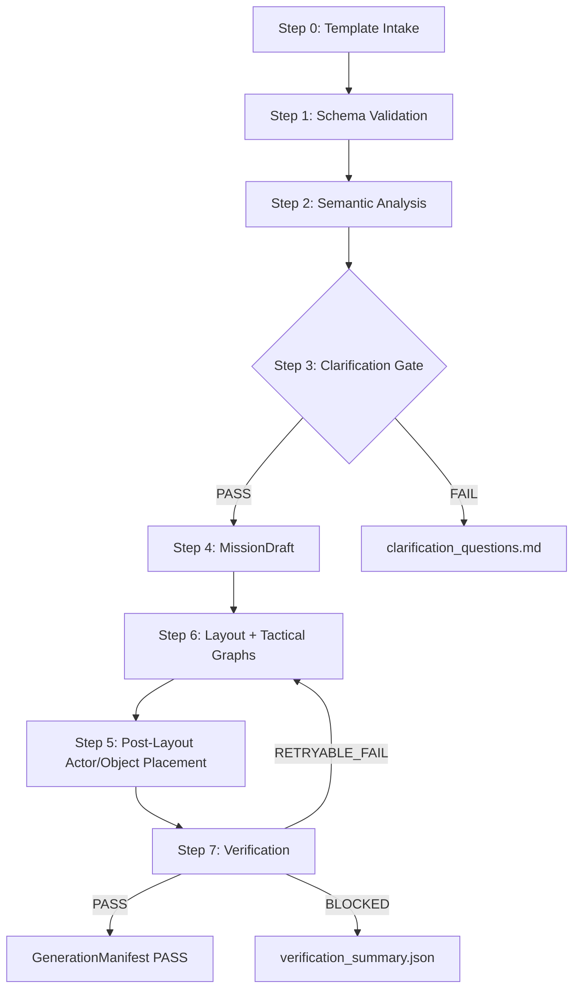

# Mission Pipeline Contract v2.2

Status: Full Release Specification  
Version: 2.2  
Project: `Breach Scenario Engine`

This document defines the implementation contract for turning a user-authored
mission template into generated Unity mission assets.

## 1. Authority

The pipeline must follow:

- [breach_mcp_architecture_v2.2.md](breach_mcp_architecture_v2.2.md)
- [mission_authoring_contract_v2.2.md](mission_authoring_contract_v2.2.md)
- [mission_data_contract_v2.2.md](mission_data_contract_v2.2.md)
- [generation_manifest_contract_v2.2.md](generation_manifest_contract_v2.2.md)

## 2. Canonical Flow



Step 6 intentionally runs before Step 5. Actor placement must never happen
against a missing or stale `LayoutGraph`.

## 3. Step Contract

| Step | Name | Input | Output | Blocking Failure |
|---:|---|---|---|---|
| 0 | Template Intake | `mission_design.template.yaml` | raw template model | `TPL_FILE_MISSING` |
| 1 | Schema Validation | raw template model | validated template | `TPL_SCHEMA_INVALID` |
| 2 | Semantic Analysis | validated template + profiles | semantic report | `TPL_SEMANTIC_INVALID` |
| 3 | Clarification Gate | semantic report | pass or questions | `TPL_CLARIFICATION_REQUIRED` |
| 4 | MissionDraft | validated template | `MissionDraft` | `DRAFT_COMPILE_FAILED` |
| 6 | Layout + Graphs | `MissionDraft` + profiles | `LayoutGraph`, tactical graphs | `LAYOUT_GENERATION_FAILED` |
| 5 | Placement | generated layout | placed actors and objects | `ORDER_VIOLATION_NO_LAYOUT_GRAPH` |
| 7 | Verification | scene + graphs + manifest | verification result | `MISSION_VERIFICATION_FAILED` |

## 4. Required Artifacts

All generated artifacts are mission-scoped under:

`UserMissionSources/missions/<missionId>/`

Required generated files:

- `mission_payload.generated.json`
- `mission_compile_report.json`
- `generation_manifest.json`
- `verification_summary.json`

Optional generated files:

- `clarification_questions.md`
- `codex_review.json`
- `mission_state.json`

These generated files are ignored by git and may be recreated.

## 5. Compiler Mapping

The compiler owns the deterministic mapping from authoring YAML to runtime JSON.

| Authoring Field | MissionDraft Field | Payload Field | Manifest Field |
|---|---|---|---|
| `schemaVersion` | `schemaVersion` | `header.schemaVersion` | `pipelineVersion` |
| `missionId` | `missionId` | `header.missionId` | `missionId` |
| `generationMeta.initialSeed` | `requestedSeed` | `header.initialSeed` | `requestedSeed` |
| none | `effectiveSeed` | `header.effectiveSeed` | `effectiveSeed` |
| `spatialConstraints.worldBounds` | `worldBounds` | `spatial.bounds` | none |
| `spatialConstraints.tacticalTheme` | `tacticalTheme` | `spatial.theme` | `profileRefs.tacticalThemeProfile` |
| `actorRoster[]` | `actors[]` | `roster[]` | none |
| `objectives` | `objectives` | `objectives` | none |

`effectiveSeed`, `retrySeeds`, and `layoutRevisionId` are never authored by a
designer. They are generated after verification.

## 6. Retry Policy

Retries are allowed only after Step 7 returns a retryable failure:

- `NAV_BREACHPOINT_UNREACHABLE`
- `NAV_OBJECTIVE_UNREACHABLE`
- `LAYOUT_GENERATION_FAILED`
- `TB-AUD-003`
- `TACTICAL_DENSITY_IMPOSSIBLE_BUDGET`

Retries are not allowed for schema errors, unknown fields, missing required
profiles, or unsupported profile versions.

## 7. MCP Tool Surface

The first implementation may use internal commands, but the public MCP surface
should converge on these mission actions:

- `manage_mission(action="validate_template")`
- `manage_mission(action="compile_payload")`
- `manage_mission(action="generate_layout")`
- `manage_mission(action="place_entities")`
- `manage_mission(action="verify")`
- `manage_mission(action="write_manifest")`

Each action must return a machine-readable result with:

```json
{
  "status": "PASS_OR_FAIL",
  "missionId": "VS01_HostageApartment",
  "pipelineVersion": "2.2",
  "artifacts": [],
  "findings": []
}
```

## 8. Acceptance Gate

A mission is accepted only when:

- Step 6 ran before Step 5.
- Step 5 used the current `layoutRevisionId`.
- Step 7 returned `PASS`.
- `generation_manifest.json` has `status: "PASS"`.
- `effectiveSeed` is non-zero.
- `mission_payload.generated.json` validates against the payload contract.
- Generated scene objects have stable generated ownership markers.
