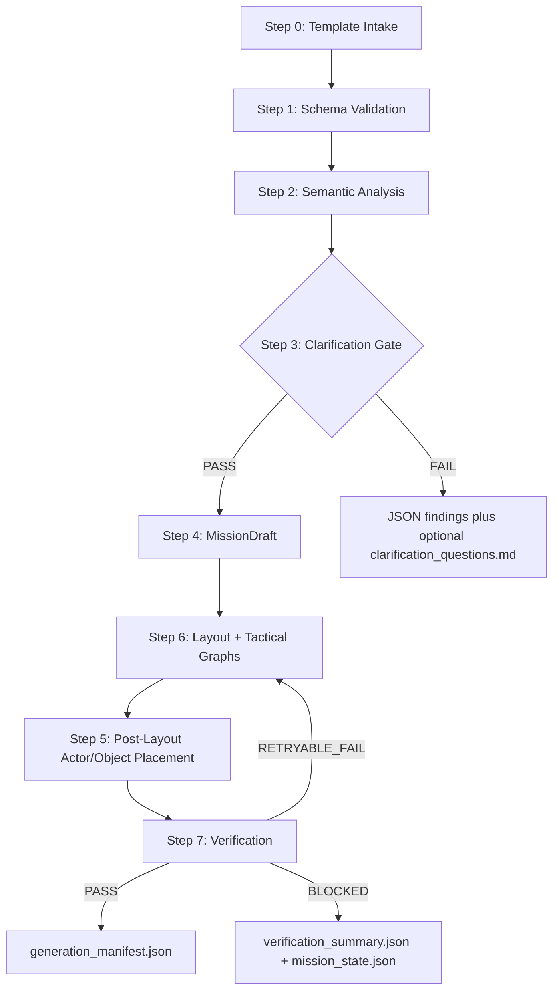

# Mission Pipeline Contract v2.3

Status: Active documentation contract
Version: 2.3
Project: `Breach Scenario Engine`

This document defines the v2.3 implementation contract for turning a
user-authored mission template into generated Unity mission artifacts.

## 1. Authority

The pipeline must follow:

- [breach_mcp_architecture_v2.3.md](breach_mcp_architecture_v2.3.md)
- [mission_authoring_contract_v2.3.md](mission_authoring_contract_v2.3.md)
- [mission_data_contract_v2.3.md](mission_data_contract_v2.3.md)
- [generation_manifest_contract_v2.3.md](generation_manifest_contract_v2.3.md)

## 2. Canonical Flow



Step 6 intentionally runs before Step 5. Actor and objective placement must
never happen against a missing or stale `LayoutGraph`.

## 3. Step Contract

| Step | Name | Input | Output | Blocking Failure |
|---:|---|---|---|---|
| 0 | Template Intake | `mission_design.template.yaml` | raw template model | `TPL_FILE_MISSING` |
| 1 | Schema Validation | raw template model | validated template | `TPL_SCHEMA_INVALID`, `TPL_UNKNOWN_FIELD`, `TPL_RANGE_INVALID` |
| 2 | Semantic Analysis | validated template + profiles/catalogs | semantic report | `TPL_PROFILE_REF_MISSING`, `TPL_OBJECTIVE_INVALID`, `TPL_ACTOR_ROSTER_INVALID` |
| 3 | Clarification Gate | semantic report | pass or questions | `TPL_CLARIFICATION_REQUIRED` |
| 4 | MissionDraft | validated template | `MissionDraft`, compile report | `DRAFT_COMPILE_FAILED` |
| 6 | Layout + Graphs | `MissionDraft` + profiles/catalogs | layout and tactical graphs | `LAYOUT_GENERATION_FAILED` |
| 5 | Placement | current layout | placed actors and objects | `ORDER_VIOLATION_NO_LAYOUT_GRAPH`, `ORDER_VIOLATION_STALE_LAYOUT` |
| 7 | Verification | payload + graphs + placements | verification summary | `MISSION_VERIFICATION_FAILED` |

## 4. Public MCP Surface

The public mission surface is:

- `manage_mission(action="validate_template")`
- `manage_mission(action="compile_payload")`
- `manage_mission(action="generate_layout")`
- `manage_mission(action="place_entities")`
- `manage_mission(action="verify")`
- `manage_mission(action="write_manifest")`

Each action returns one JSON decision envelope. The JSON may be serialized into
tool result text by the Unity bridge, but callers must be able to parse it as
JSON without reading Markdown.

Required envelope shape:

```json
{
  "status": "PASS_OR_FAIL",
  "missionId": "VS01_HostageApartment",
  "pipelineVersion": "2.3",
  "action": "validate_template",
  "artifacts": [],
  "findings": [],
  "metrics": {},
  "state": {
    "currentStep": "VALIDATING",
    "jobId": ""
  }
}
```

Markdown reports may duplicate information for humans, but they are never a
decision source for an agent or tool.

## 5. Required Artifacts

All generated artifacts are mission-scoped under:

`UserMissionSources/missions/<missionId>/`

Generated files:

- `mission_payload.generated.json`
- `mission_compile_report.json`
- `mission_layout.generated.json`
- `mission_entities.generated.json`
- `verification_summary.json`
- `mission_state.json`

Accepted-generation file:

- `generation_manifest.json`

Transient lifecycle file:

- `.generation.lock`

Optional human-readable duplicates:

- `clarification_questions.md`
- Markdown run logs

`generation_manifest.json` must not be written unless Step 7 passed for the
current layout.

## 6. Compiler Mapping

The compiler owns deterministic mapping from authoring YAML to runtime JSON.

| Authoring Field | MissionDraft Field | Payload Field | Manifest Field |
|---|---|---|---|
| `schemaVersion` | `templateSchemaVersion` | derived `header.schemaVersion` | `pipelineVersion` |
| `missionId` | `missionId` | `header.missionId` | `missionId` |
| `generationMeta.initialSeed` | `requestedSeed` | `header.initialSeed` | `requestedSeed` |
| none | `effectiveSeed` | `header.effectiveSeed` | `effectiveSeed` |
| `spatialConstraints.worldBounds` | `worldBounds` | `spatial.bounds` | none |
| `spatialConstraints.tacticalTheme` | `tacticalTheme` | `spatial.theme` | `profileRefs.tacticalThemeProfile` |
| `actorRoster[]` | `actors[]` | `roster[]` | none |
| `objectives` | `objectives` | `objectives` | none |

`effectiveSeed`, `retrySeeds`, `layoutRevisionId`, lifecycle state, lock state,
and generated ownership markers are never authored by a designer.

## 7. Retry Policy

Retries are allowed only after Step 7 returns a retryable failure:

- `NAV_BREACHPOINT_UNREACHABLE`
- `NAV_OBJECTIVE_UNREACHABLE`
- `LAYOUT_GENERATION_FAILED`
- `TB-AUD-003`
- `TACTICAL_DENSITY_IMPOSSIBLE_BUDGET`

Retries are not allowed for:

- template schema errors
- unknown fields
- missing or unsupported profiles
- missing or unsupported catalogs
- lifecycle state conflicts
- lock conflicts
- payload schema failures

Retry seed derivation:

`retrySeed = Hash32(requestedSeed, missionId, layoutAttemptIndex, failureCode, pipelineVersion)`

Every retry executes:

1. Step 6 with the retry seed
2. Step 5 against the new layout
3. Step 7 against the new placement

Retry must not jump directly to Step 5.

## 8. Lifecycle Rules

`mission_state.json` records the current state and current step for incomplete,
failed, blocked, or successful runs.

Allowed states:

- `IDLE`
- `VALIDATING`
- `COMPILED`
- `LAYOUT_GENERATED`
- `ENTITIES_PLACED`
- `VERIFYING`
- `RETRYING`
- `PASS`
- `FAILED`
- `BLOCKED`

`write_manifest` is valid only after `verification_summary.status == "PASS"`
for the current `layoutRevisionId`.

## 9. Acceptance Gate

A mission is accepted only when:

- Step 6 ran before Step 5.
- Step 5 used the current `layoutRevisionId`.
- Step 7 returned `PASS`.
- `generation_manifest.json` has `status: "PASS"`.
- `effectiveSeed` is non-zero and was written after PASS.
- `mission_payload.generated.json` validates against the v2.3 payload contract.
- Generated scene objects have stable generated ownership markers.
- All decision fields were emitted as JSON.
